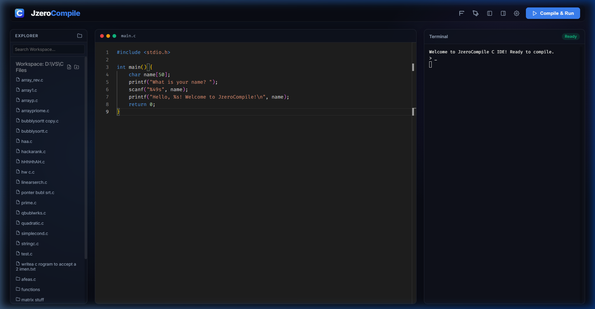
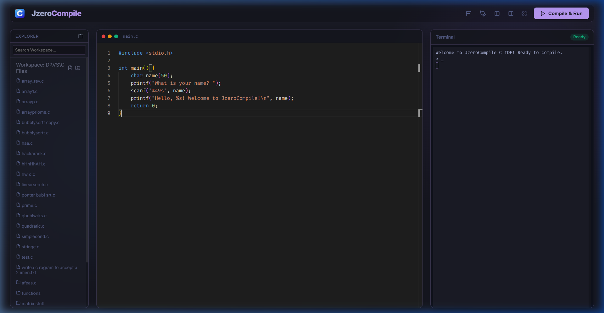
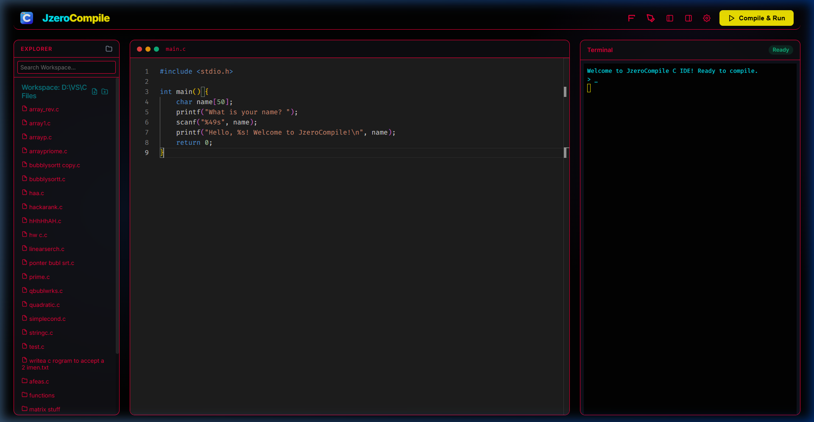

# JzeroCompiler IDE 🚀

JzeroCompiler is a high-performance, aesthetically stunning C Compiler IDE built with a "God Tier" user experience in mind. It is a lightweight, visual GUI alternative to heavy IDEs like VS Code, designed specifically for speed and simplicity.

## ✨ Why JzeroCompiler?

### 🔋 Extreme Resource Efficiency
While heavy IDEs like **VS Code** can consume upwards of **1200MB (1.2GB) of RAM**, JzeroCompiler runs at a lightning-fast **300MB at max**. That is **~75% less resource usage**, making it the perfect choice for students and developers who want a smooth, lag-free coding experience without slowing down their PC.

### 🎓 Designed for C Developers
Setting up C environments in VS Code or complex IDEs can be a nightmare for engineering students. JzeroCompiler removes the mess:
- **Zero Configuration**: No complex project files or linker settings.
- **Workspace Persistence**: Remembers your workspace path even after restart.
- **Glassmorphic UI**: A premium, modern design that makes coding feel like the future.
- **Interactive Background**: Beautiful ripple wave effects that respond to your touch.

## ✨ Key Features

- **75% Lighter**: Massive performance gains over traditional IDEs.
- **Real-time Terminal**: Interactive terminal with bidirectional communication.
- **Monaco Editor**: Powered by the same engine as VS Code for world-class syntax highlighting.
- **7 Premium Themes**: Midnight Glow, Nordic White (Redesigned), Tokyo Night, Cyberpunk 2077, Oled Luxe, Retro Amber, and Oceanic Abyss.
- **Smart Compilation**: Auto-injects common C fixes (like output buffering) so your `printf` works perfectly every time.
- **Smart Auto-save**: Safely saves your work with a 1.5s debounce.
- **Customizable Typography**: Control font size and line spacing for better readability.

## 🎨 Theme Gallery

### Midnight Glow (Default)

### Tokyo Night

### Cyberpunk 2077

## 🛠️ Tech Stack

- **Backend**: Node.js, Express, Socket.io
- **Frontend**: Vanilla JS, Monaco Editor, Xterm.js
- **Compiler**: GCC (MinGW)

## 🚀 How to Run
### 1. Standalone Version (Recommended)
Just double-click **`JzeroCompiler.exe`**. 
- **NO Node.js required.**
- Open-and-use experience.
- Automatically launches the IDE in your default browser.

### 2. Desktop App Version (Electron)
Located in `dist/JzeroCompiler-win32-x64/`, run **`JzeroCompiler.exe`** for a dedicated window experience.

### 3. Developer / Node.js Version
If you want to modify the code:
1. **Install Node.js**: [nodejs.org](https://nodejs.org/).
2. **Install Dependencies**: `npm install`.
3. **Run**: `node server.js` or `npm start`.

---
Developed with ❤️ for B.Tech students and developers who want a beautiful, lightweight coding experience.
