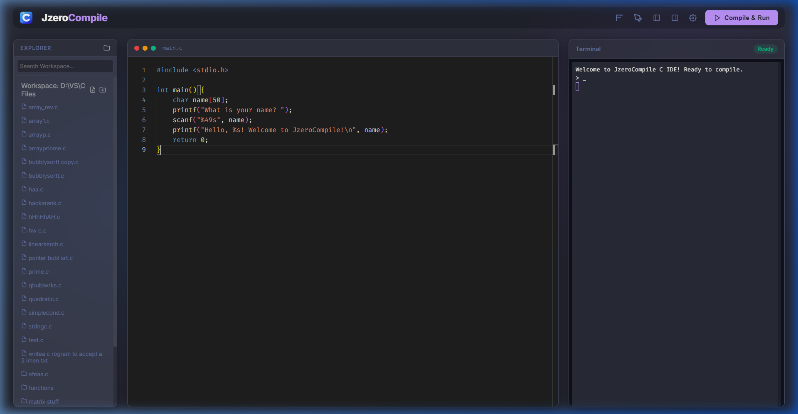
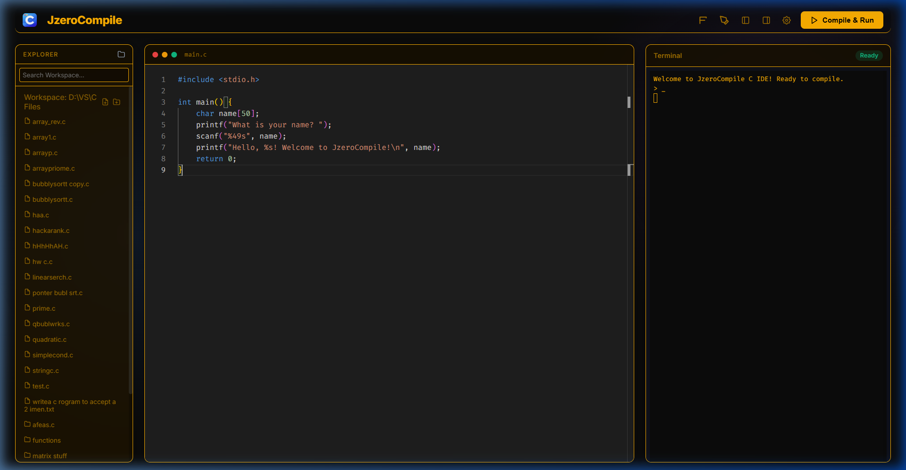
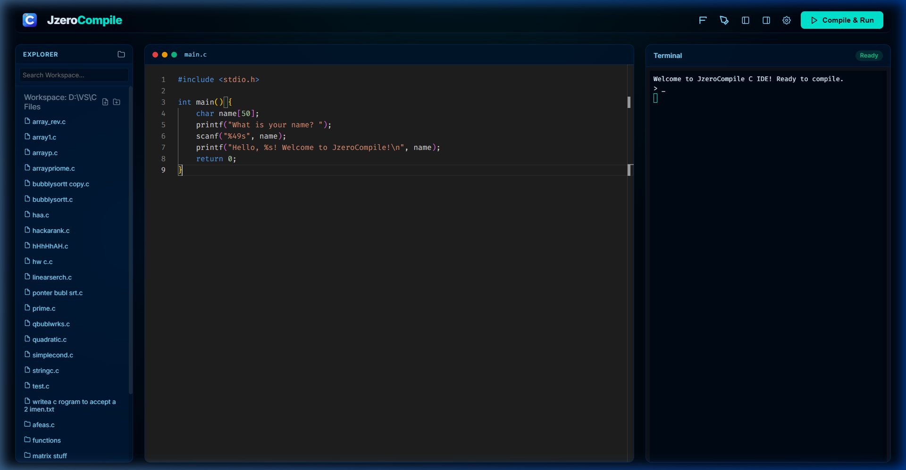
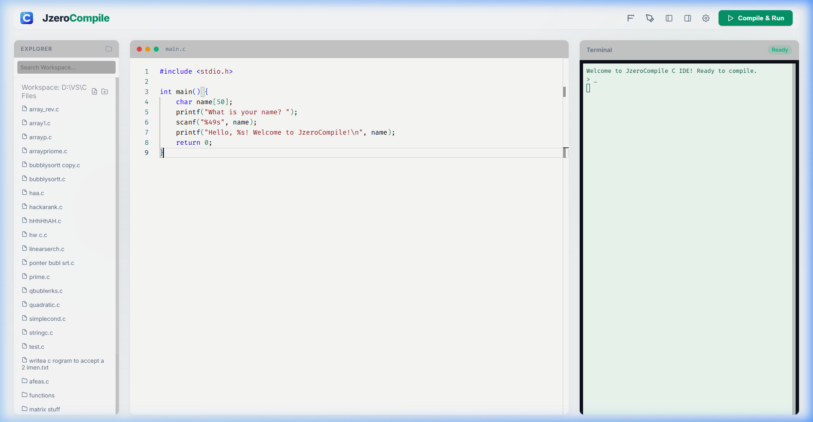

# JzeroCompile IDE 🚀

JzeroCompile is a high-performance, aesthetically stunning C Compiler IDE built with a "God Tier" user experience in mind. It features a modern glassmorphic interface, real-time terminal input/output, and a powerful theme system.

## ✨ Features

- **Real-time Terminal**: Interactive terminal with bidirectional communication for immediate feedback.
- **Monaco Editor Integration**: Powered by the same engine as VS Code, providing world-class syntax highlighting and code editing.
- **Multi-Theme System**: 7 beautifully crafted themes to suit any developer's mood (Midnight Glow, Tokyo Night, Cyberpunk, etc.).
- **Portable Workspace**: Easily change and manage your project directories directly from the sidebar.
- **Glassmorphic UI**: A premium, modern design with subtle animations and fluid transitions.
- **Smart Compilation**: Auto-injects common C fixes (like output buffering) to ensure a smooth running experience.

## 🎨 Theme Gallery

### Midnight Glow (Default)

### Tokyo Night

### Cyberpunk 2077

### Dracula

### Retro Amber

### Oceanic Abyss

### Emerald Forest

## 🛠️ Tech Stack

- **Backend**: Node.js, Express, Socket.io
- **Frontend**: Vanilla JS, Monaco Editor, Xterm.js
- **Compiler**: GCC (MinGW)

## 🚀 Getting Started

1. Clone the repository.
2. Ensure you have Node.js and GCC installed.
3. Run `npm install` to install dependencies.
4. Start the server using `node server.js`.
5. Open `http://localhost:3000` in your browser.

---
Developed with ❤️ for developers who love premium design and fast C compilation.
